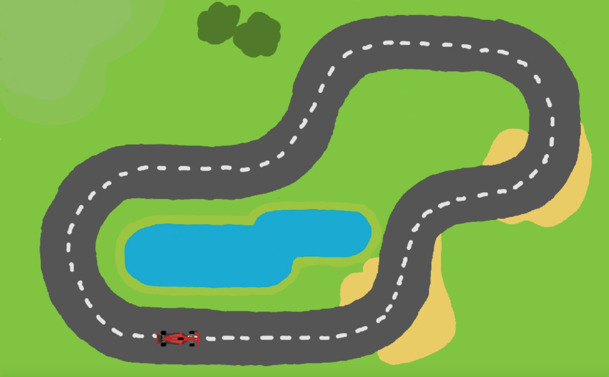

# Car-Game
Neuroevolution of augmenting topologies (NEAT) agent learning a simple 2D car game.

  
  

# How-To-Run
Run the neural agent training:

  python3 main.py

Try out the game yourself:

  python3 cargame.py
