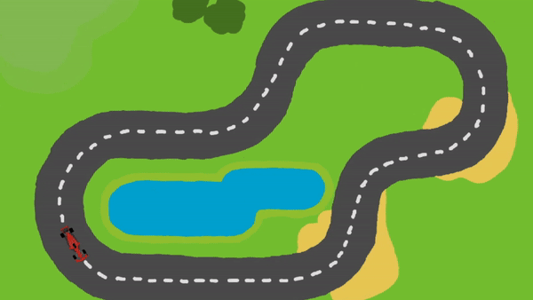
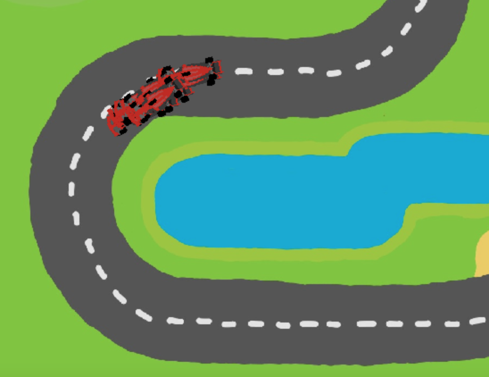
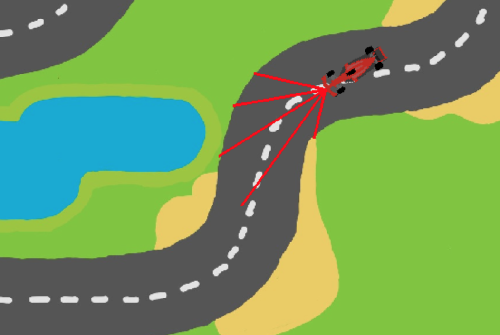

# neuroevolution-racing
Neuroevolution of augmenting topologies (NEAT) agent learning to drive a car around a simple racing track.

  
  

## How-To-Run

### Insall the requirements:

    pip install -r requirements.txt

### Run the main.py file:

    python main.py
